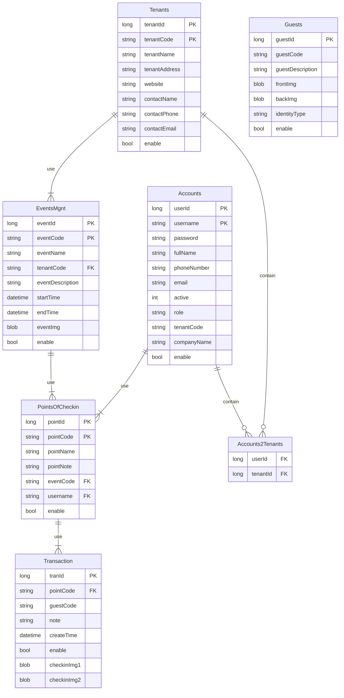

## Thiết kế cơ sở dữ liệu

- Cơ sở dữ liệu gồm 7 bảng theo thiết kế sau:

```mermaid
erDiagram
    Tenants ||--|{ EventsMgnt : use
    EventsMgnt ||--|{ PointsOfCheckin : use
    Accounts ||--|{ PointsOfCheckin : use
    PointsOfCheckin ||--|{ Transaction : use
    Guests
    Accounts ||--o{ Accounts2Tenants : contain
    Tenants ||--o{ Accounts2Tenants : contain

    Accounts {
        long userId PK
        string username PK
        string password
        string fullName
        string phoneNumber
        string email
        int active
        string role
        string tenantCode
        string companyName
        bool enable
    }

    Tenants {
        long tenantId PK
        string tenantCode PK
        string tenantName
        string tenantAddress
        string website
        string contactName
        string contactPhone
        string contactEmail
        bool enable
    }

    Accounts2Tenants {
        long userId FK
        long tenantId FK
    }

    EventsMgnt {
        long eventId PK
        string eventCode PK
        string eventName
        string tenantCode FK
        string eventDescription
        datetime startTime
        datetime endTime
        blob eventImg
        bool enable
    }

    PointsOfCheckin {
        long pointId PK
        string pointCode PK
        string pointName
        string pointNote
        string eventCode FK
        string username FK
        bool enable
    }

    Guests {
        long guestId PK
        string guestCode
        string guestDescription
        blob frontImg
        blob backImg
        string identityType
        bool enable
    }

    Transaction {
        long tranId PK
        string pointCode FK
        string guestCode
        string note
        datetime createTime
        bool enable
        blob checkinImg1
        blob checkinImg2
    }

```
